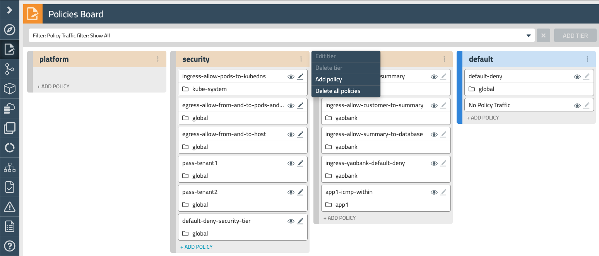
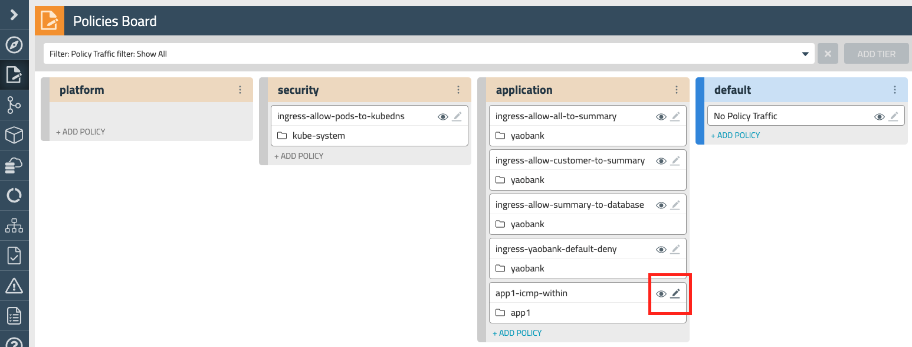

# 5. RBAC for policies

In Calico Enterprise, global network policy and network policy resources are associated with a specific tier. Admins can configure access control for these Calico Enterprise policies using standard Kubernetes Role and ClusterRole resource types. This makes it easy to manage RBAC for both Kubernetes network policies and Calico Enterprise tiered network policies. In this lab we will:

- Create service accounts 
- Implement RBAC controls 
- Verify access to the right policy resources for each account

## 5.1. Create service accounts

We will create two service accounts. One will belong to our security administrator, who will be in charge of implementing network security policies with a broader scope and which affect the whole environment. Those will be created in our security tier.

The second account belongs to our developer. He must be able to access the application, or default tiers, but not able to see or modify any other policy higher in the hierarchy. He will not able to see or edit global policies, as the case of our `default-deny` policy applied in the default tier. Let's create our two service accounts.

```
kubectl create -f 5.1-users.yaml
```
```
serviceaccount/secuser created
serviceaccount/devuser created
```

## 5.2. Create the cluster wide roles

Now let's create the needed Cluster roles, and bindings, so we assign the right access to each account. Please take a time to check the two files for them:

```
cat 5.1-security.yaml
```
```
cat 5.1-developer.yaml
```

As you can see, both accounts are associated with the roles "ui-traffic-stats", and "ui-policy-board-reader", however only the security person (`secuser`) have full access to the security tier through the role "security-tier-policy-cruder".

Our other person (`devsuer`) can only work in the application and default tiers. Let's apply those cluster wide roles and bindings:

```
kubectl apply -f 5.1-security.yaml
```
```
kubectl create -f 5.1-developer.yaml
```

## 5.3. Restrict the developer user to a namespace

And now, lets restrict even more the devuser to the app1 namespace by means that a role and binding:

```
kubectl create -f 5.1-dev-ns-role.yaml
```

## 5.4. Verification

To check, Retrieve the tokens for both accounts as indicated below, and open two new Incognito windows and browse to the manager as in `https://manager.<LABNAME>.lynx.tigera.ca`, then access each window with the respective user token.

```
kubectl get secret $(kubectl get serviceaccount secuser -o jsonpath='{range .secrets[*]}{.name}{"\n"}{end}' | grep token) -o go-template='{{.data.token | base64decode}}' && echo
```
```
kubectl get secret $(kubectl get serviceaccount devuser -o jsonpath='{range .secrets[*]}{.name}{"\n"}{end}' | grep token) -o go-template='{{.data.token | base64decode}}' && echo
```

You can see the security user can edit and create policies in the Security Tier as indicated in the image below. He can see any global policy too, and configure them in that Tier.



By other hand, the devuser can only edit the application tier rules in its own namespace, non-kubernetes policies in the default tier, and he cannot create/edit or see global policies.



If you recall the previous lab, we implemented tenant rules in our security Tier, so we could delegate more specific rules to the owners of the namespace, with RBAC we made specific access to that namespace rules to certain accounts.
